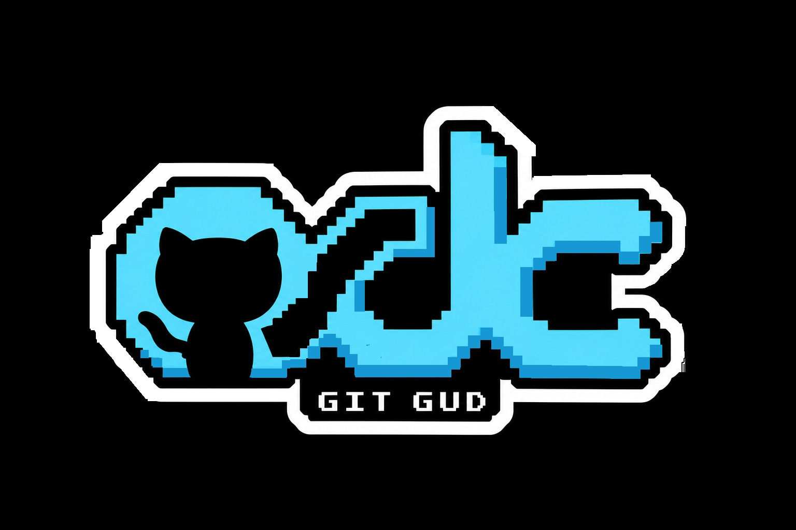

<p align="center">
	
</p>

# GitGud Workshop - OSDC

GitGud workshop repository where teams learn Git by collaborating on developer and
open-source memes. Submissions are converted into images by the repository's
meme-generation workflow.

## Submit a Meme

1. Fork the repository and create a branch for your team's submission.
2. Create one directory under `submissions/` using your team's name, for
	example `submissions/team-git-gud/`.
3. Use the website to choose a meme. The website will provide the exact meme
	name to use. Copy that value into `meme_name.txt` on one line by itself.
	Do not add a URL, caption, description, or other text. Do not invent or
	change the name provided by the website.
4. Add one caption file for each caption position supported by the meme:
	`caption1.txt`, `caption2.txt`, `caption3.txt`, and so on.
5. Have each team member edit a caption file. Team members should use Git
	branches and pull requests to practice collaboration, review, merging, and
	resolving conflicts.
6. Put only the caption text in each caption file. Keep captions short,
	readable, and appropriate for a public project.
7. Open a pull request using the [pull request guidelines](docs/pull_request_guidelines.md).
	Select the **Meme Submission** template when GitHub offers a template.

### Required Structure

```text
submissions/<team-name>/
├── meme_name.txt
├── caption1.txt
├── caption2.txt
└── ...
```

The number and order of caption files must match the selected template. The
folder name represents the team, and all members of that team contribute to
the same folder. Do not add generated images, `output/` files, or unrelated
changes to a submission PR.

### Submission Guidelines

- Use the exact meme name provided by the website. It is the template name
	used by the image generator, for example `drake` or `fine`.
- Keep `meme_name.txt` to one line containing only the meme name.
- Make the meme original or meaningfully adapted for the workshop.
- Keep the content relevant to programming, Git, open source, or developer
	culture.
- Do not submit harassment, hate speech, sexual content, personal information,
	copyrighted material that you do not have permission to use, or content that
	targets a private individual.
- Avoid `/`, `?`, and `#` in captions because captions are passed to the image
	URL by the generator.
- Check spelling, caption order, and the rendered result before requesting a
	review.
- Keep each team member's change focused on their assigned caption file when
	possible.
- Do NOT edit other Team's submission folder.

## How Images Are Generated

When files under `submissions/` change, the GitHub Actions workflow asks the
image service to regenerate the meme images using the values in
`meme_name.txt` and the caption files. The generated images are not committed
to this repository.
